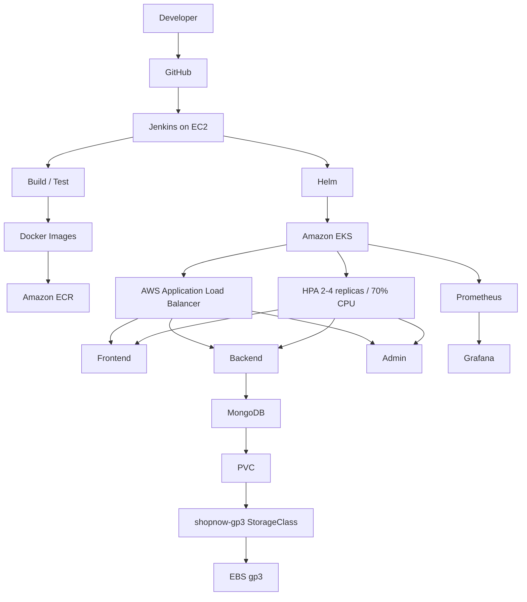

# ShopNow --- AWS EKS DevOps Capstone

> Production-style containerized e-commerce deployment on AWS using
> Terraform, Ansible, Jenkins, Kubernetes, Helm, AWS Load Balancer
> Controller, HPA, Prometheus and Grafana.

## 1. Project Overview

ShopNow is a MERN-based e-commerce application deployed as an end-to-end
Cloud/DevOps implementation.

The project demonstrates:

-   AWS infrastructure provisioning with Terraform
-   Jenkins provisioning and configuration with Ansible
-   Docker image build and Amazon ECR publishing
-   Kubernetes deployment on Amazon EKS
-   Helm-based application delivery
-   AWS Application Load Balancer ingress
-   Persistent MongoDB storage using EBS CSI and gp3
-   Kubernetes Horizontal Pod Autoscaling
-   Prometheus and Grafana observability
-   Real troubleshooting and recovery of infrastructure and Kubernetes
    failures
-   Repeatable environment cleanup using Terraform

------------------------------------------------------------------------

## 2. Architecture



### Request flow

``` text
Browser
  |
  v
AWS ALB
  |---- /       --> frontend
  |---- /api    --> backend
  |---- /admin  --> admin
                       |
                       v
                    MongoDB
                       |
                       v
                    EBS gp3
```

------------------------------------------------------------------------

## 3. Technology Stack

  Area             Technology
  ---------------- ------------------------------------
  Cloud            AWS
  Region           ap-south-1
  IaC              Terraform
  Configuration    Ansible
  CI/CD            Jenkins
  Source Control   GitHub
  Containers       Docker
  Registry         Amazon ECR
  Kubernetes       Amazon EKS
  Packaging        Helm
  Ingress          AWS Load Balancer Controller + ALB
  Storage          EBS CSI + gp3
  Database         MongoDB
  Autoscaling      Kubernetes HPA
  Metrics          Prometheus
  Visualization    Grafana
  Application      MERN

------------------------------------------------------------------------

## 4. Repository Structure

``` text
shopNow/
├── admin/
├── backend/
├── frontend/
├── helm/shopnow/
├── terraform/
├── terraform-bootstrap/
├── ansible/
├── platform/
├── Jenkinsfile
├── README.md
└── docs/screenshots/
```

------------------------------------------------------------------------

## 5. Infrastructure Provisioning

Terraform provisions the AWS foundation:

-   VPC
-   Public/private subnets
-   Internet Gateway
-   NAT Gateway
-   Route tables
-   EKS cluster and worker infrastructure
-   IAM roles
-   Jenkins EC2 instance
-   Amazon ECR repositories
-   AWS Load Balancer Controller IAM role

Example:

``` bash
terraform -chdir=terraform init
terraform -chdir=terraform validate
terraform -chdir=terraform plan
terraform -chdir=terraform apply
```

The final clean deployment successfully created:

``` text
Apply complete! Resources: 48 added, 0 changed, 0 destroyed.
```

ECR repositories use:

``` hcl
force_delete = true
```

to make development-environment teardown repeatable even when
repositories contain images.

------------------------------------------------------------------------

## 6. Jenkins Provisioning with Ansible

Jenkins is provisioned through Ansible rather than being manually
installed on the EC2 instance.

The playbook configures:

-   Jenkins
-   Java
-   Git
-   Docker
-   kubectl
-   Helm
-   Terraform
-   AWS CLI
-   supporting utilities

Example:

``` bash
ansible-playbook   -i ansible/inventory/hosts.ini   ansible/site.yml
```

Final verification:

``` text
jenkins-server : ok=30 changed=6 failed=0
```

and:

``` text
active
LISTEN ... *:8080 ...
```


------------------------------------------------------------------------

## 7. CI/CD Pipeline

The Jenkins pipeline follows:

``` text
Checkout
   ↓
Build / Test
   ↓
Docker Build
   ↓
ECR Push
   ↓
EKS kubeconfig
   ↓
Helm Deployment
   ↓
Deployment Verification
   ↓
Application Health Verification
```

Helm deployment:

``` bash
helm upgrade --install shopnow ./helm/shopnow   --namespace shopnow   --set frontend.image.repository="${ECR_REGISTRY}/shopnow-frontend"   --set frontend.image.tag="${IMAGE_TAG}"   --set backend.image.repository="${ECR_REGISTRY}/shopnow-backend"   --set backend.image.tag="${IMAGE_TAG}"   --set admin.image.repository="${ECR_REGISTRY}/shopnow-admin"   --set admin.image.tag="${IMAGE_TAG}"   --wait   --timeout 10m
```

Final pipeline result:

``` text
ShopNow deployment completed successfully.
Application version: v3
Finished: SUCCESS
```

------------------------------------------------------------------------

## 8. Kubernetes Platform Bootstrap

Cluster-scoped resources are intentionally separated from application
deployment.

``` bash
./platform/bootstrap-eks-platform.sh
```

The platform bootstrap creates/configures:

-   `shopnow` namespace
-   `shopnow-gp3` StorageClass
-   AWS Load Balancer Controller
-   kube-prometheus-stack

StorageClass:

``` yaml
apiVersion: storage.k8s.io/v1
kind: StorageClass
metadata:
  name: shopnow-gp3
provisioner: ebs.csi.aws.com
volumeBindingMode: WaitForFirstConsumer
allowVolumeExpansion: true
reclaimPolicy: Delete
parameters:
  type: gp3
  fsType: ext4
```

This separation prevents the application deployment pipeline from
requiring unnecessary cluster-scoped permissions.

------------------------------------------------------------------------

## 9. Persistent MongoDB Storage

MongoDB uses a PersistentVolumeClaim backed by AWS EBS.

``` yaml
apiVersion: v1
kind: PersistentVolumeClaim
metadata:
  name: {{ .Values.mongodb.persistence.name }}
  namespace: {{ .Release.Namespace }}
spec:
  accessModes:
    - ReadWriteOnce
  storageClassName: shopnow-gp3
  resources:
    requests:
      storage: {{ .Values.mongodb.persistence.size }}
```

Storage flow:

``` text
MongoDB
   ↓
PVC
   ↓
shopnow-gp3
   ↓
AWS EBS CSI Driver
   ↓
EBS gp3
```

------------------------------------------------------------------------

## 10. Ingress and Application Validation

The AWS Load Balancer Controller provisions an internet-facing ALB.

Ingress routing:

``` text
/       → frontend:80
/api    → backend:5000
/admin  → admin:80
```

Verification:

``` bash
kubectl get ingress shopnow-ingress -n shopnow -o wide
```

Backend health:

``` bash
curl -s http://<ALB-DNS-NAME>/api/health
```

Example:

``` json
{"status":"OK","message":"ShopNow API is running"}
```

The application was tested in the browser. Navigation, categories and
Add to Cart functionality were verified.


------------------------------------------------------------------------

## 11. Horizontal Pod Autoscaling

Application HPAs use:

``` text
Minimum replicas: 2
Maximum replicas: 4
CPU target: 70%
```

### Baseline

``` text
shopnow-backend    cpu: 1%/70%    replicas: 2
```


### Scale-up

During load testing, backend CPU crossed the target and the deployment
scaled to three replicas.

``` text
shopnow-backend    cpu: 62%/70%    replicas: 3
```


### Scale-down

After the load subsided, HPA returned the deployment to two replicas.

``` text
shopnow-backend    cpu: 1%/70%    replicas: 2
```


This demonstrates both scale-up and scale-down behavior.

------------------------------------------------------------------------

## 12. Observability

The platform uses:

``` text
Prometheus
    ↓
Metrics
    ↓
Grafana
    ↓
Kubernetes dashboards
```

### EKS infrastructure monitoring

Grafana **Kubernetes / Compute Resources / Nodes Overview** provides:

-   Node and pod count
-   CPU usage
-   Memory usage
-   CPU utilization per node
-   Memory utilization per node


### ShopNow pod monitoring

Grafana **Kubernetes / Compute Resources / Namespace (Pods)** was
filtered to the `shopnow` namespace.

It provides:

-   CPU utilization
-   CPU usage over time
-   Memory usage
-   Memory quotas
-   Network activity
-   Individual pod metrics


### ShopNow workload monitoring

Grafana **Kubernetes / Compute Resources / Namespace (Workloads)**
provides:

-   Workload CPU usage
-   CPU quota information
-   Workload memory usage
-   Memory quota information
-   Network usage
-   Receive/transmit bandwidth


------------------------------------------------------------------------

## 13. Troubleshooting and Lessons Learned

### 13.1 Jenkins could not access the StorageClass

The pipeline initially failed with:

``` text
storageclasses.storage.k8s.io "shopnow-gp3" is forbidden:
User "...assumed-role/shopnow-jenkins-role/..."
cannot get resource "storageclasses"
at the cluster scope
```

**Resolution:** cluster-scoped StorageClass creation was moved into the
platform bootstrap. Jenkins only deploys the application.

------------------------------------------------------------------------

### 13.2 MongoDB PVC remained Pending

The PVC initially showed:

``` text
STATUS: Pending
STORAGECLASS: <unset>
```

**Resolution:** the PVC was explicitly configured with:

``` yaml
storageClassName: shopnow-gp3
```

and the StorageClass uses:

``` yaml
provisioner: ebs.csi.aws.com
```

MongoDB subsequently became healthy with its EBS-backed volume.

------------------------------------------------------------------------

### 13.3 Jenkins provisioning failed during a kubectl download

Ansible encountered:

``` text
failed to create temporary content file:
The read operation timed out
```

The failure occurred while downloading kubectl.

**Resolution:** the Ansible provisioning was rerun after addressing the
transient download/provisioning problem.

Final play recap:

``` text
ok=30 changed=6 unreachable=0 failed=0
```

------------------------------------------------------------------------

### 13.4 Jenkins health-check pod was blocked by RBAC

The initial pipeline health check attempted to create a temporary pod in
the `default` namespace:

``` bash
kubectl run shopnow-health-check --rm --attach ...
```

Kubernetes rejected it:

``` text
pods is forbidden:
User "...assumed-role/shopnow-jenkins-role/..."
cannot create resource "pods"
in the namespace "default"
```

**Resolution:** deployment verification was changed so that it does not
require unauthorized pod creation. Application health was subsequently
verified through the ALB endpoint.

------------------------------------------------------------------------

### 13.5 Terraform destroy encountered dependencies

The first destroy attempt encountered errors such as:

``` text
ECR Repository ... not empty
```

and:

``` text
Network ... has some mapped public address(es)
```

Some resources had already been removed manually, creating Terraform
drift.

**Resolution:**

-   AWS resources were reconciled.
-   Terraform state was cleaned where resources had already been
    deleted.
-   ECR repositories were configured with `force_delete = true`.
-   The environment was recreated successfully.

This is an important lesson: **manual deletion during a
Terraform-managed lifecycle can create drift and complicate later
destroys.**

------------------------------------------------------------------------

## 14. Security and Engineering Practices

-   Jenkins uses an IAM role rather than hard-coded AWS credentials.
-   Kubernetes permissions are kept as scoped as practical.
-   Platform and application resources are separated.
-   Secrets and credentials are not committed to Git.
-   EC2 administrative access is restricted rather than opened broadly.
-   AWS Load Balancer Controller uses an IAM role.
-   EBS CSI provides persistent database storage.
-   Production deployments should use HTTPS/TLS and managed DNS.
-   The capstone HTTP ALB endpoint was used only for validation.

------------------------------------------------------------------------

## 15. Final Validation Checklist

-   [x] AWS infrastructure provisioned with Terraform
-   [x] VPC and networking configured
-   [x] EKS cluster provisioned
-   [x] Jenkins provisioned with Ansible
-   [x] Jenkins dashboard operational
-   [x] Docker images built
-   [x] Images pushed to Amazon ECR
-   [x] Helm chart deployed to EKS
-   [x] Frontend deployed
-   [x] Backend deployed
-   [x] Admin deployed
-   [x] MongoDB deployed
-   [x] EBS-backed persistent storage configured
-   [x] AWS Load Balancer Controller installed
-   [x] Internet-facing ALB provisioned
-   [x] Path-based ingress verified
-   [x] Application opened successfully in browser
-   [x] Product navigation tested
-   [x] Add-to-cart functionality tested
-   [x] Backend health endpoint verified
-   [x] HPA scale-up verified
-   [x] HPA scale-down verified
-   [x] Prometheus deployed
-   [x] Grafana deployed
-   [x] EKS node metrics verified
-   [x] ShopNow pod metrics verified
-   [x] ShopNow workload metrics verified
-   [x] Jenkins pipeline completed successfully

------------------------------------------------------------------------

## 16. Cleanup

AWS resources should be destroyed after validation to avoid unnecessary
ongoing charges.

``` bash
cd ~/herovired/capstone4/shopNow

terraform -chdir=terraform destroy
```

After destruction, verify:

``` bash
aws eks list-clusters --region ap-south-1

aws ec2 describe-nat-gateways   --region ap-south-1   --filter Name=state,Values=available,pending

aws elbv2 describe-load-balancers   --region ap-south-1
```

Also verify ECR repositories and EC2 instances if required.

The cleanup step is especially important for development environments
because EKS, NAT Gateway, ALB, EC2 and EBS resources can continue
generating AWS charges while provisioned.

------------------------------------------------------------------------

## 17. Project Outcome

The final implementation demonstrates the complete cloud-native delivery
path:

``` text
Source Code
    ↓
GitHub
    ↓
Jenkins
    ↓
Docker
    ↓
Amazon ECR
    ↓
Helm
    ↓
Amazon EKS
    ↓
AWS ALB
    ↓
ShopNow
    ↓
HPA
    ↓
Prometheus
    ↓
Grafana
```

More importantly, the project demonstrates real operational
troubleshooting rather than only a successful happy-path deployment.

The implementation required diagnosing and resolving Kubernetes RBAC,
persistent storage, Jenkins provisioning, Terraform drift, AWS
networking dependencies, application health verification and autoscaling
behavior.

------------------------------------------------------------------------

## 18. Evidence Screenshots

Screenshots are stored under:

``` text
docs/screenshots/
```

Recommended evidence:

``` text
09_Jenkins_Dashboard.png
10_ShopNow_Application.png
11_ShopNow_Shopping_Cart.png
17_HPA_Initial_2_Replicas.png
18_HPA_Scaled_Up_3_Replicas.png
19_HPA_Scaled_Down_2_Replicas.png
21_Grafana_EKS_Nodes_Overview.png
22_Grafana_ShopNow_Pod_Metrics.png
23_Grafana_ShopNow_Workload_Metrics.png
```

------------------------------------------------------------------------

## Author

**Hari Prasad N**

Cloud & Platform Engineering \| AWS \| Kubernetes \| DevOps \| DevSecOps
\| Terraform \| Ansible \| CI/CD
